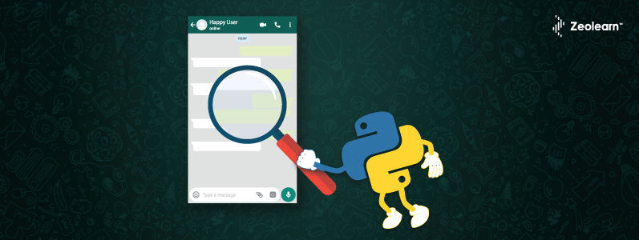

# API-Project
4th project for Ironhack bootcamp

**_How close are you to your friends? To whichone the most? Is there really good vibes in the chat group?_**

You can answer those questions that are in the introduction by using the API I have developed in this project. Let me resume you what and how I have worked first.

### RESUME👨🏻‍💻

The main objective of the project was to develop an API that would allow me to send it some parameters and it will respond with an analysis of those variables that I have passed to it through the following endpoints:

  1.-`/user/create/<username>` 🙎🏾‍♀️
  - **Purpose:** Create a user and save him into DB
  
  2.-`/chat/create/<chatname>`📱
  - **Purpose:** Create a conversation to load messages
  
  3.- `/chat/<chatName>/add/<userName>` 🙎🏾‍♀️📲
  - **Purpose:** Add a user to a chat, this is optional just in case you want to add more users to a chat after it's creation.
  
  4.- `/chat/<chatName>/<userName>/write/<message>` 📝
  - **Purpose:** Add a message to the conversation. 
  
  5.-`/chat/<chatName>/list` 🗒
  - **Purpose:** Get all messages from a chat
  
  6.-`/chat/<chatName>/sentiment`😊😡
  - **Purpose:** Analyze the positive or negative sentiments from the messages of a chat. Using `NLTK` sentiment analysis     package for this task
  
  7.-`/user/<userName>/recommend`👯‍♂️
  - **Purpose:** Recommend friend to this user based on chat contents
  
  
### WORK PROCESS 💻 ⚙️

You can find the code I wrote in SRC folder between the files: app.py (the one that runs the code) and data.py which has the backwork of the code.

I developed my API using Flask, after that, I wrote the variables that I wanted the API answer me using python at the same time I was developing a db in mongodb in order to test my code. 

The second part of the project was to upload the app through mongo db atlas (being able to have the db in the cloud), Heroku working with docker image (in order to have my app online) and conecting it all.

I made some test using the "EndPoints_check.ipynb" file, but I made as well a funnier simulation with a conversation from the "Rick and Morty" american sitcom episode that you will find in "RickAndMorty_SentimentAnalysis_RecommendationAnalysis.ipynb" file.

  - Python 3 
  - Mongodb and mongo atlas
  - Heroku
  - Docker
  - Modules pandas, numpy, sklearn, nltk. 
  - Request module in order to get some information through some APIs
  - Visual Studio Code

Hope you like it.

LSG
